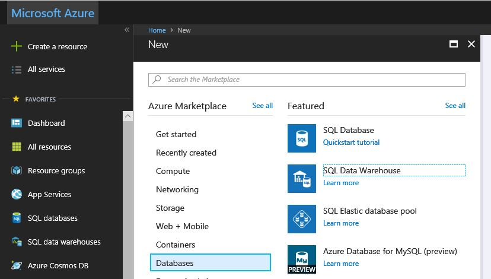
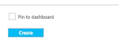
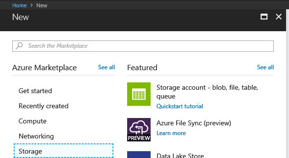

## Azure Subscription
As stated in the requirements section, the workshop requires an active Azure subscription.
!!<h4>Recommendation</h4>It is recommended that you do not use an Azure subscription that is currently being used for production.  The CLI will create it's own resource groups, but it is not the best practice to utilize production environments for testing and workshops, such as this.

For best results, it is recommended that you setup register for the trial subscription as outlined on the [previous](./01_Azure_Registration.md) page.

## **Exercise 0:** Before the workshop
Duration: 60 mins
Synopsis: Before attending the workshop, you should follow these steps to prepare your environment for an efficient day.

### **Task 1:** Provision Power BI
1. If you do not already have a Power BI account, go to [https://www.powerbi.com](https://www.powerbi.com).

2. On the page, enter your work email address (it should be the same account as the one you use for your Azure subscription) and select **Use it free**.

3. Follow the on-screen prompts and your Power BI environment should be ready within minutes. You can always return to it via [https://app.powerbi.com](https://app.powerbi.com).

### **Task 2:** Provision Azure SQL Data Warehouse

Using the Azure Portal, provision a new instance of SQL Data Warehouse.

1. Click **+New**, select **Data + Storage**, **SQL Data Warehouse**.

2. Provide a Name for the SQL Data Warehouse.

3. Set the **Performance** to **100 DWU**. (You will not need any more for this orkshop.)

4. Select Server.

5. Create a new server or use an existing server as desired.
6. Select **Create**.

### **Task 3:** Provision a Storage Account
Using the Azure Portal, provision a new Azure Storage Account to use for this workshop.
1.	Click **+New**, select **Data + Storage**, **Storage Account**. 

2. Provide a Name for the storage account.

3. For the resource group, add it to the Resource Group you are using for this workshop.

4. For the location, choose the same Location as your SQL Data Warehouse. 

5. Select **Create**.