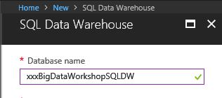

## Azure Subscription
As stated in the requirements section, the workshop requires an active Azure subscription.

!!<h4>Recommendation</h4>It is recommended that you do not use an Azure subscription that is currently being used for production.  The CLI will create it's own resource groups, but it is not the best practice to utilize production environments for testing and workshops, such as this.

For best results, it is recommended that you setup register for the trial subscription as outlined on the [previous](./01_Azure_Registration.md) page.

## **Exercise 0:** Before the workshop
Duration: 60 mins
Synopsis: Before attending the workshop, you should follow these steps to prepare your environment for an efficient day.

### **Task 1:** Provision Power BI
1. If you do not already have a Power BI account, go to [https://www.powerbi.com](https://www.powerbi.com).

2. On the page, enter your work email address (it should be the same account as the one you use for your Azure subscription) and select **Use it free**.

3. Follow the on-screen prompts and your Power BI environment should be ready within minutes. You can always return to it via [https://app.powerbi.com](https://app.powerbi.com).

### **Task 2:** Provision Azure Resource Group

Using the Azure Portal, provision a new Resource Group which will contain all of the resources created during the workshop.

1. Click **+ Create a resource**, type **resource group** in the search box, then press **Enter**.

2. Select **Resource group** from the search results, then click **Create** at bottom of Resource group blade.

3. Enter a **Resource group name**, select your **Subscription** from the dropdown, then choose the appropriate **Resource group location**, such as **East US**. Click **Create** at bottom of Resource group blade.

### **Task 3:** Provision Azure SQL Data Warehouse

Using the Azure Portal, provision a new instance of SQL Data Warehouse.

1. Click **+Create a resource**, select **Databases**, **SQL Data Warehouse**.

2. Provide a Name for the SQL Data Warehouse.

3. Select **Use existing** for **Resource group**, then select the resource group you created in Task 2.

4. Under **Select source** use the default **Blank database** option

5. Select **Configure required settings** under Server.

6. Click **Create a new server**.

7. On the New server blade, enter a **Server name**, enter a **Server admin login**, enter a **Password**, and keep default location. Ensure the checkbox, **Allow azure services to access server** is checked then press **Select**.

8. Click **Performance tier** to open the **Configure Performance** blade.

9. On the **Configure Performance** blade, on the **Optimized for Elasticity** tab, slide the slider under **Scale your system** to the left until the box reads **DW100**, then click **Apply**. (This is all the scale you will need for this workshop.)

10. Back on the SQL Data Warehouse blade, click **Create**

### **Task 4:** Provision a Storage Account
Using the Azure Portal, provision a new Azure Storage Account to use for this workshop.
1.	Click **+Create a resource**, select **Storage**, **Storage Account- blob, file, table, queue**. 

2. Provide a Name for the storage account.

3. Leave default settings for Deployment model, Account kind, Performance, Replication, Secure transfer required, and Subscription.

3. For the **Resource group**, select the resource group you created in Task 2.

4. For the **Location**, choose the same Location as your SQL Data Warehouse.

5. Select **Create**.