## **Exercise 1:** Environment setup
Duration: 20 minutes

Synopsis: In this exercise, attendees will download the start project files and take a tour of the provided solution. 

### **Task 1:** Download and unzip the sample

  1. Download the sample project from the following link: http://bit.ly/238cJDY.
  2. Extract the ZIP file.
  3. Open the solution AdventureWorksTravel.sln using Visual Studio.
  4. In Solution Explorer, right-click the Project and select **Publish**.
  5. In the first dialog box, under Select a Publish Target, click **Microsoft Azure App Service**.
  6. Sign in to your account when prompted.
  7. Click **New**.
  8. In the Create App Service dialog box, provide a name for the web app. Choose your subscription and choose to use an existing App Service Plan (if you already have one) or create a new one. If you choose to create a new App Service plan, provide a name for that new App Service plan. Similarly, if creating a new App Service plan, choose an existing Resource Group or create a new one and provide a name for the new resource group (e.g., hackathon).
  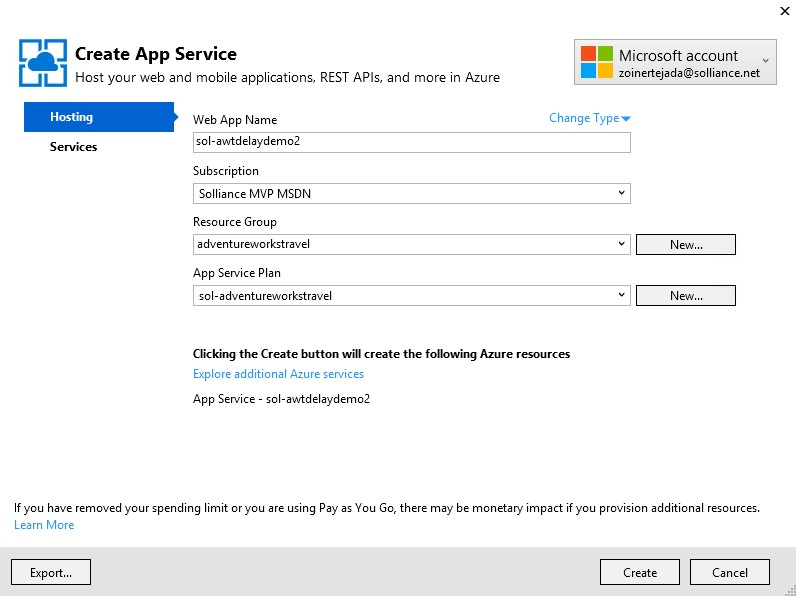
  9. Click **Create**.
  10. Click **Publish**. After a few moments, the initial version of the web app should appear in the browser.

### **Task 2:** Register Web App with Azure Active Directory 

  1. Login in to the existing portal https://manage.windowsazure.com/ using the same credentials you used for Power BI.
  2. Click the **active directory** tab.
  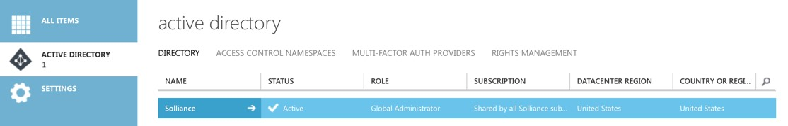
  3. Click the name of your default directory in the grid.
  4. Click the **Applications** tab.
  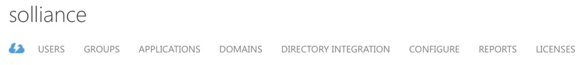
  5. In the command bar at the bottom, click **Add**.
     * 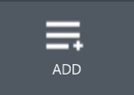
  6. In the dialog box, click **Add an application my organization is developing**.
  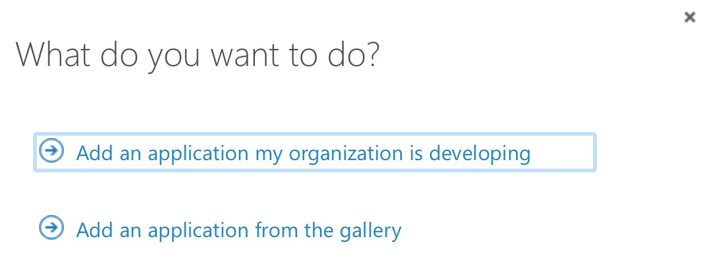
  7. In the next dialog box, enter a unique name for your application (e.g., “AdventureWorksTravelYourMSAlias”) and leave the Web Application radio button selected.
  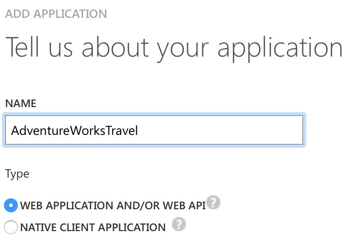
  8. Click the right arrow button to move to the next screen.
  9. For both fields, provide the URL to your newly deployed web app (make sure the URLs start with https).
  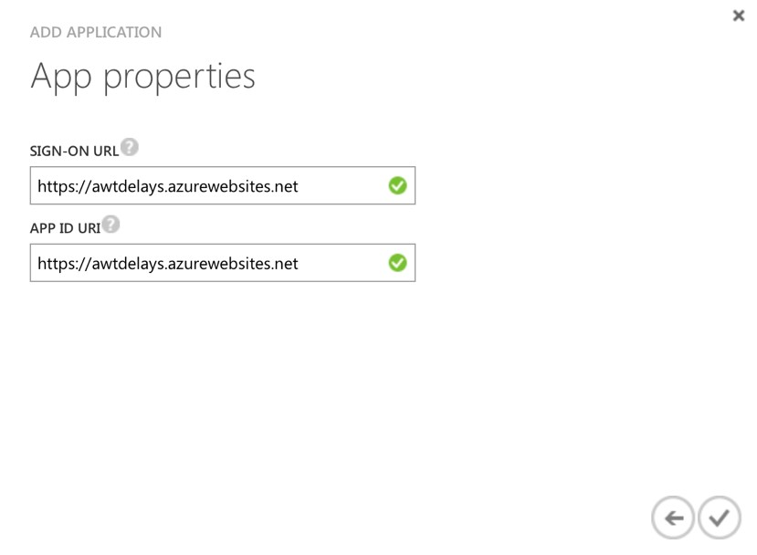
  10. Click the checkmark button.
  11. On the dashboard for your application, click the **Configure** tab.
  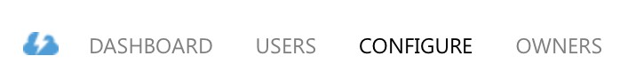
  12. Scroll down to the permissions to other applications section and click **Add application**
  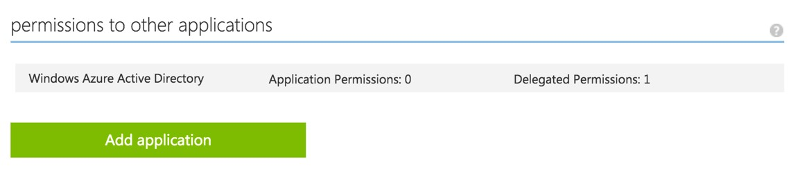
  13. In the dialog click on Power BI Service so that it appears in the list on the right and then click the checkmark.
  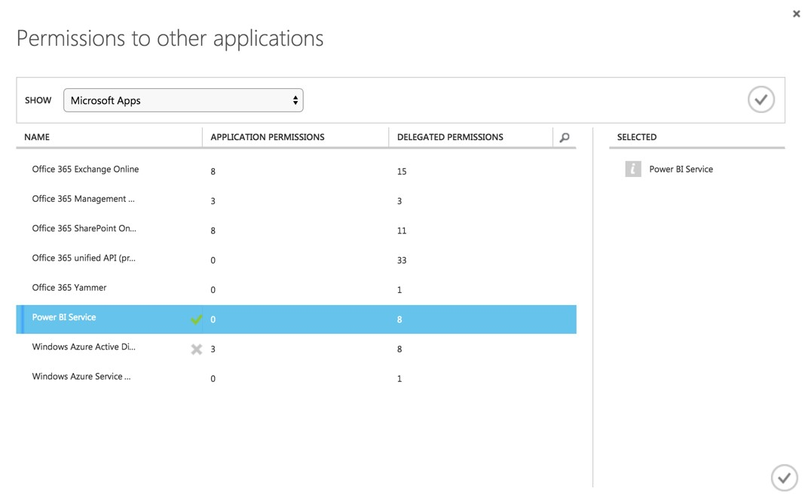

  !!<h4>Power BI</h4>If Power BI Service does not show up on the list of applications, visit https://powerbi.microsoft.com/en-us/documentation/powerbi-admin-free-with-custom-azure-directory/ to learn how to correct this. You will need to log in to Power BI as an organizational user within your directory before the service shows up in AAD.

  14. In the Power BI Service row that appears, click on **Delegated permissions** and check **View all Dashboards**.
  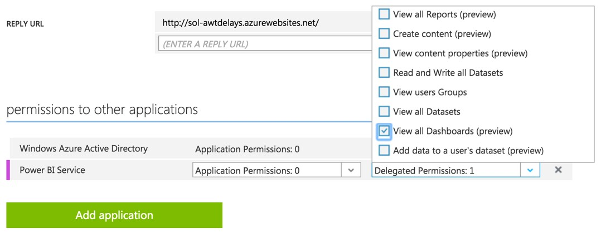
  15. Scroll up to the Keys section.
  16. Click the **Select duration** drop-down and select **1 year**. 
  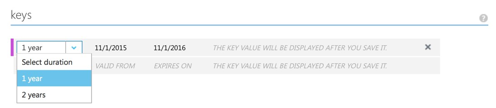
  17. Click **Save** in the command bar at the bottom.
  18. Copy the key value that appears after the save completes.
  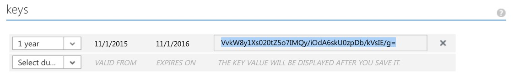
  19. Return to the sample app in Visual Studio, right-click the project in Solution Explorer and select **Properties**. 
  20. Click the **Settings** tab. For the value of the ClientSecret setting, paste the key you just copied.
  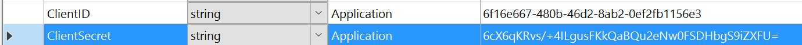
  21. Return to the Configure page and copy the Client ID value.
  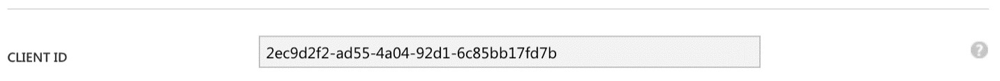
  22. In the sample Settings, paste the value of the ClientID in the ClientID setting.
  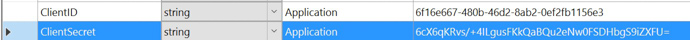
  23. Set the value of the RedirectURL to the URL of your newly deployed web app (including HTTPS), and append /Redirect to the end.
  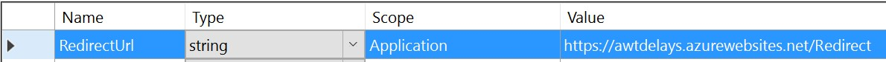
  24. Save the project.

### **Task 3:** Update sample app with Storage Account credentials
  1. Using the New Portal, navigate to the blade for your Storage Account.
  2. Click **Access Keys**.
  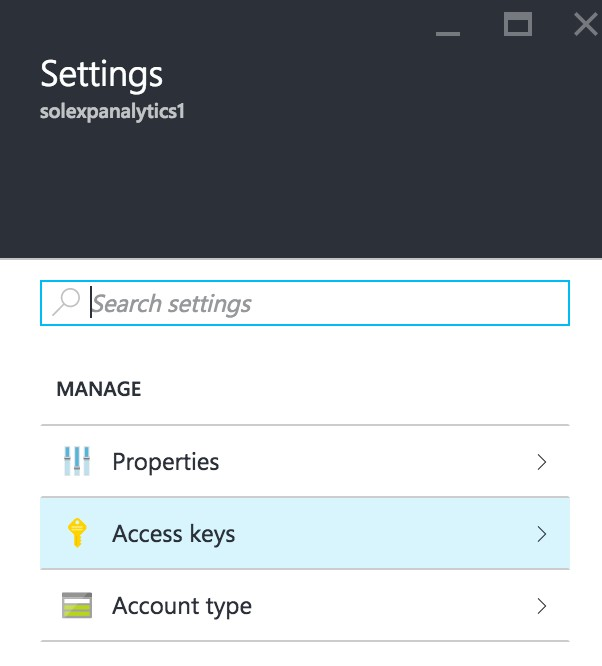
  3. To the right of key1 in the table, click the ellipses (…) and select View connection string.
  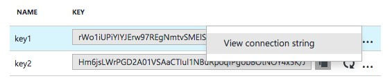
  4. Copy the displayed **Connection String**. Be sure to copy the entire Connection String, not the Access key only.
  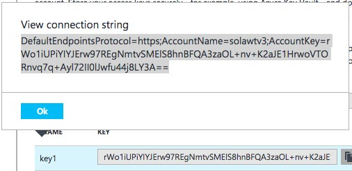
  5. Return to the settings pane of the sample web app, and paste this connection string into the value field of the ML_StorageAccount setting.
  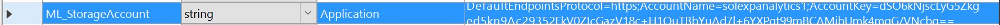
  6. Save the project.