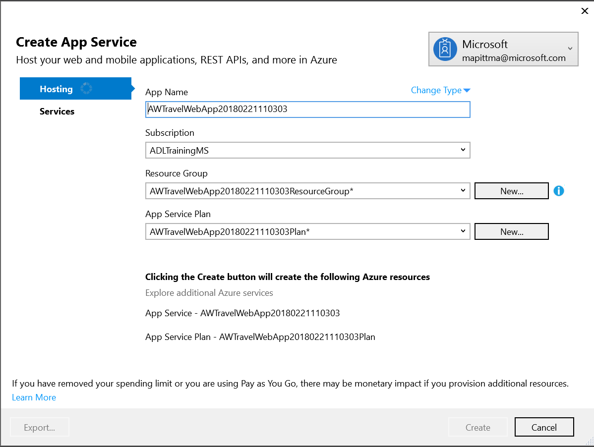
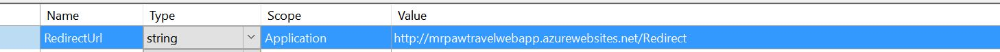
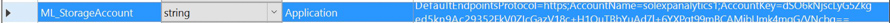

## **Exercise 1:** Environment setup

**Duration:** 20 minutes

**Synopsis:** In this exercise, attendees will download the start project files and take a tour of the provided solution. 

### **Task 1:** Download and unzip the sample

  1. Download the sample project from the following link: [http://bit.ly/238cJDY](http://bit.ly/238cJDY).

  2. Extract the ZIP file.

  3. Open the solution AdventureWorksTravel.sln using Visual Studio.

  4. In Solution Explorer, right-click the Project and select **Publish**.

  5. In the first dialog box, under Select a Publish Target, click **Microsoft Azure App Service**.

  6. Sign in to your account when prompted.

  7. Click **New**.

  8. In the Create App Service dialog box, provide a name for the web app. Choose your subscription and choose to use an existing App Service Plan (if you already have one) or create a new one. If you choose to create a new App Service plan, provide a name for that new App Service plan. Similarly, if creating a new App Service plan, choose an existing Resource Group or create a new one and provide a name for the new resource group (e.g., workshop).
  

  9. Click **Create**.

  10. Click **Publish**. After a few moments, the initial version of the web app should appear in the browser.

### **Task 2:** Register Web App with Azure Active Directory 

  1. Login in to the existing portal [https://portal.azure.com/](https://portal.azure.com/) using the same credentials as above.

  2. Click the **active directory** tab.

  

  3. Click the **App Registrations** tab.

  

  5. At the top of the page, click **+ New application registration**.

  

  6. On the Create App Registration blade enter a unique **Name** for your application (e.g., “AdventureWorksTravel_YourInitials”)

  7. Leave the default Application type as **Web app / API**

  8. Enter the **Sign-on URL**, which can be copied from the **Site URL** in Visual Studio in the Summary section for your published application.

    

  10. Click the **Create** button.

  

  11. On the Registered app blade for your application, click on **Settings**.

  

  12. Under API ACCESS, select **Required permissions**

  

  13. On the Required Permissions blade, select **+ Add**

  

  14. On the Add API Access blade, click **Select an API**

  

  15. On the Select an API blade, select the **Power BI Service**, then click **Select**.

  

  16. On the Enable Access blade under **DELEGATED PERMISSIONS**, select the checkbox next to **View all Dashboards (preview)** then click **Select**.

  

  17. On the Add API access blade, select **Done**.

  

  18. Close the Required permisions blade.

!!<h4>Power BI</h4>If Power BI Service does not show up on the list of applications, visit [powerbi.microsoft.com](https://powerbi.microsoft.com/en-us/documentation/powerbi-admin-free-with-custom-azure-directory/) to learn how to correct this. You will need to log in to Power BI as an organizational user within your directory before the service shows up in AAD.

  14. In the Settings blade under API ACCESS, click on **Keys**.

  

  15. In the Keys blade, under **DESCRIPTION** enter **pbi_access_key**.

  16. Under **EXPIRES** , click the Duration drop-down and select **1 year**. Leave the field under **VALUE** blank, as the key will be generated when you click Save.

  

  17. Click **Save** at the top of the Keys blade.

  18. Close the **Keys** blade.

  18. Close the **Settings** blade.

  18. Copy the key value that appears after the save completes.
  

  19. Close the **Keys** blade

  20. Close the **Settings** blade

  19. Return to the AWTravelWebApp Solution in Visual Studio, right-click the project in Solution Explorer and select **Properties**. 

  20. Click the **Settings** tab. For the value of the ClientSecret setting, paste the key you just copied.

  

  21. Return to the Azure portal. From the AdventureWorks_Travel_xxx Registered app page, copy the Application ID value.

  

  22. Return to Visual Studio. In the AWTravelWebApp_xxx project Settings, paste the value of the Application ID in the ClientID setting.

  

  23. Set the value of the RedirectURL to the URL of your newly deployed web app (including HTTPS), and append /Redirect to the end.

  

  24. Save the project.

### **Task 3:** Update sample app with Storage Account credentials

  1. Using the Azure Portal, navigate to the blade for your Storage Account.

  2. Click **Access Keys**.
  

  3. To the right of key1 in the table, click the ellipses (…) and select View connection string.
  

  4. Copy the displayed **Connection String**. Be sure to copy the entire Connection String, not the Access key only.
  

  5. Return to the settings pane of the sample web app, and paste this connection string into the value field of the ML_StorageAccount setting.
  

  6. Save the project.