## **Exercise 3:** Building a ML Model

**Duration:** 90 mins

**Synopsis:** In this exercise, attendees will implement a classification experiment. They will load the training data from their local machine into a dataset. Then they will explore the data to identify the primary components they should use for prediction, and use two different algorithms for predicting the classification. They will evaluate the performance of both and algorithms choose the algorithm that performs best. The model selected will be exposed as a web service that is integrated with the sample web app.  

### **Task 1:** Create ML Workspace

1.	Login to the existing Azure portal.
2.	Click **+ New**, search for **Machine Learning Workspaces**.
3.	Click on Machine Learning Workspace to open the Workspaces blade and click on Create.
4.	Enter a workspace name, a subscription, the existing Resource Group, location nearest you, create a new storage account, choose the Standard pricing tier, create a new Web Service plan and finally choose DevTest Standard pricing tier for free.  
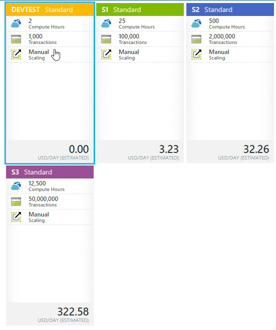
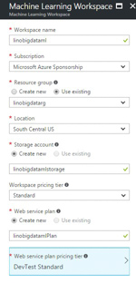
5.	Click **Create**.
6.	Navigate to your ML workspace by clicking **Machine Learning** Workspace in the Resource Group blade.

7.	In the additional links, click **Launch Machine Learning Studio** to open your workspace using the development environment ML Studio.


### **Task 2:** Upload the Sample Datasets

1.	Before you begin creating a machine learning experiment, there are three datasets you need to load.
2.	Download the three CSV sample datasets from here: http://bit.ly/1Hrm5es 
3.	Extract the ZIP and verify you have the following files:
    * FlightDelaysWithAirportCodes.csv
    * FlightWeatherWithAirportCodes.csv 
    * AirportCodeLocationLookupClean.csv
4.	Within Machine Learning Studio, click **+ NEW** at the bottom, point to **Dataset**, and select **From Local File**.

5.	In the dialog that appears, click **Choose File** and browse to the FlightDelaysWithAirportCodes file and click **Open**. 
6.	Change the name of the dataset to “FlightDelaysWithAirportCodes” and click the checkmark to upload the data into a new dataset.

7.	Repeat the previous step for the FlightWeatherWithAirportCodes and AirportCodeLocationsClean, setting the name for the dataset in a similar fashion.

### **Task 3:** Start a new experiment

1.	Click **+ NEW** in the command bar.
2.	 In the options that appear, click **Blank Experiment**.

3.	Give your new experiment a name, such as AdventureWorks Travel by editing the label near the top of the design surface.

4.	In the toolbar on the left, in the Search experiment items box, type the name of the dataset you created with flight delay data (FlightDelaysWithAirportCodes). You should see a component for it listed under Saved Datasets, My Datasets. 

5.	Click and drag on the FlightDelaysWithAirportCodes to add it to the design surface.

6.	Next, you will explore each of the datasets to understand what kind of cleanup (aka data munging) will be necessary. 
7.	Hover over the output port of the FlightDelaysWithAirportCodes dataset. 

8.	Right-click on the port and select **Visualize**.

9.	A new dialog will appear showing a maximum of 100 rows by 100 columns sample of the dataset. You can see at the top that the dataset has a total of 2,719,418 rows (also referred to as examples in Machine Learning literature) and has 20 columns (also referred to as features).

10.	Because all 20 columns are displayed, you can scroll the grid horizontally. Scroll until you see the DepDel15 column and click it to view statistics about the column. The DepDel15 column displays a 1 when the flight was delayed at least 15 minutes and 0 if there was no such delay. In the model you will construct, you will try to predict the value of this column for future data. 

11.	Notice in the Statistics panel that a value of 27444 appears for Missing Values. This means that 27,444 rows do not have a value in this column. Since this value is very important to our model, we will eliminate any rows that do not have a value for this column. 
12.	To eliminate these problem rows, close the dialog and go back to the design surface. From the toolbar, search for **Clean Missing Data**.
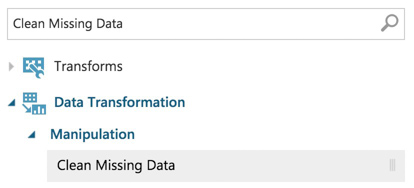
13.	Drag this module on to the design surface beneath your FlightDelaysWithAirportCodes dataset. Click the small circle at the bottom of the FlightDelaysWithAirportCodes dataset, drag and release when your mouse is over the circle found in the top center of the Clean Missing Data module. These circles are referred to as ports, and by taking this action you have connected the output port of the dataset with the input port of the Clean Missing Data module, which means the data from the dataset will flow along this path.
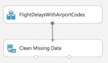
14.	Click **Save** on the command bar at the bottom to save your in-progress experiment.

15.	Click **Run** in the command bar at the bottom to run the experiment.

16.	When the experiment is finished running, you will see a finished message in the top right corner of the design surface, and green check marks over all modules that ran. 

17.	You should run your experiment whenever you need to update the metadata describing what data is flowing through the modules, so that newly added modules can be aware of the shape of your data (most modules have dialogs that can suggest columns, but before they can make suggestions you need to have run your experiment). 
18.	Click the **Clean Missing Data** module to select it. The property panel on the right will display the settings appropriate to the selected module. 
19.	In this case, we want to remove rows that have no value for the DepDel15 column. Begin by clicking **Launch Column Selector**.
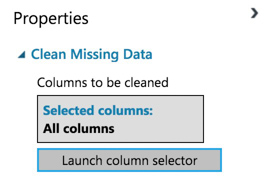
20.	For the **Begin With** drop down, select **No Columns**. In the row of controls that appears, change the second drop down to **Include** and then **Column Names**. Then in the text box that appears begin to type DepDel15 and select that item from type-ahead list. 
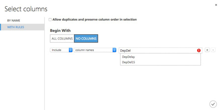
21.	Click the checkmark to apply the settings. You have now indicated to the Clean Missing Data module that the DepDel15 is the only column it should act on.

22.	In the **Properties** panel for **Clean Missing Data**, click the **Cleaning mode** drop-down and select **Remove entire row**. Now your Clean Missing Data module is fully configured to remove any rows that are missing values for DepDel15.

23.	To verify the result, run your experiment again. After it is finished, click the left output port (Cleaned dataset) of the Clean Missing Data module and select **Visualize**. 
24.	In the dialog that appears, scroll over to DepDel15 and click the column. In the statistics you should see that Missing Values reads 0.

25.	Our model will approximate departure times to the nearest hour, but departure time is captured as an integer. For example, 8:37 am is captured as 837. Therefore, we will need to process the CRSDepTime column and round it down to the nearest hour. To perform this rounding will require two steps, first you will need to divide the value by 100 (so that 837 becomes 8.37). Second, you will round this value down to the nearest hour (so that 8.37 becomes 8).
26.	Begin by adding an Apply Math Operation module beneath the Clean Missing Data module and connect the output port (1) of the Clean Missing Data module to the input port of the Apply Math Operation.

27.	In the properties of the Apply Math Operation, set the Category to **Operations**, Basic operation to **Divide**, Operation argument type to **Constant**, Constant operation argument to **100**, Selected columns to **CRSDepTime**, and Output mode to **Append**.

28.	Run the experiment to update the metadata.
29.	This module will add a new column to the dataset called Divide(CRSDeptTime_$100), but we want to rename it to CRSDepHour. To do so, add an **Edit Metadata** module and connect its input port to the output port of Apply Math Operation.
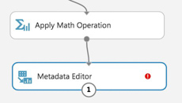
30.	For the properties of the Metadata Editor, set the Selected Columns to **Divide(CRSDeptTime_$100)**
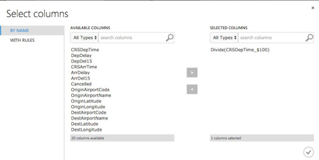
31.	 Back on the Properties for the Metadata Editor, set New column names to **CRSDepHour**.
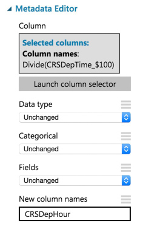
32.	Run the experiment to update the metadata.
33.	Add another **Apply Math Operation** module to round the time down to the nearest hour. Set the Category to **Rounding**, Selected columns to **CRSDepHour**, and Output mode to **Inplace**.

34.	Run the experiment to update the metadata.
35.	We do not need all of the columns present in the FlightDelaysWithAirportCodes dataset. To pare down the columns we can use multiple options, but in this case we chose to use an R Script module that selects out only the columns of interest using R code.
36.	Add an **Execute R Script** module beneath the last Apply Math Operation, and connect the output of the Apply Math Operation to the first input port (leftmost) of the Execute R Script.

37.	In the **Properties** panel for Execute R Script, click the **Double Windows** icon  to maximize the script editor.
38.	Replace the script with the following and click the check mark to save it. (Press CTRL+A to select all then CTRL+V to paste and then immediately click the check mark—do not worry if the formatting is off before hitting the check mark.)
```R
ds.flights <- maml.mapInputPort(1)
# Trim the columns to only those we will use for the predictive model
ds.flights = ds.flights[, c("OriginAirportCode","OriginLatitude", "OriginLongitude", "Month", "DayofMonth", "CRSDepHour", "DayOfWeek", "Carrier", "DestAirportCode", "DestLatitude", "DestLongitude", "DepDel15")]
maml.mapOutputPort("ds.flights");
```
39.	Run the experiment to update the metadata.
40.	Right-click on the first output port of your Execute R Script module and select **Visualize**. 
41.	Verify that the dataset only contains the 12 columns referenced in the R script. 

42.	At this point the Flight Delay Data is prepared, and we turn to preparing the historical weather data. 

### **Task 4:** Prepare the weather data

1.	To the right of the FlightDelaysWithAirportCodes dataset, add the **FlightWeatherWithAirportCodes** dataset. 

2.	Right-click the output port of the FlightWeatherWithAirportCodes dataset and select **Visualize**.
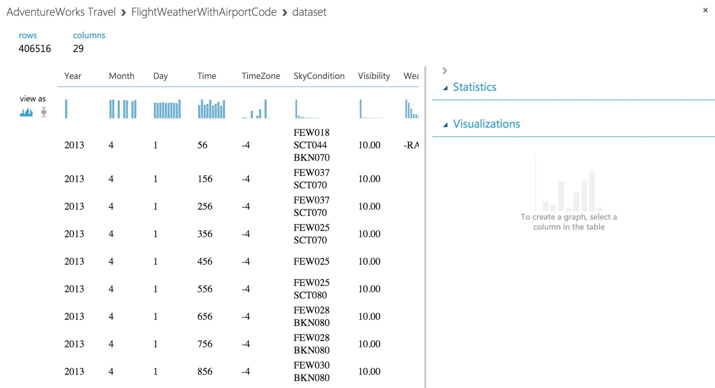
3.	Observe that this data set has 406,516 rows and 29 columns. For this model, we are going to focus on predicting delays using WindSpeed (in MPH), SeaLevelPressure (in inches of Hg), and HourlyPrecip (in inches). We will focus on preparing the data for those features.
4.	In the dialog, click the **WindSpeed** column and review the statistics. Observe that the Feature Type was inferred as String and that there are 32 Missing Values. Below that, examine the histogram to see that, even though the type was inferred as string, the values are all actually numbers (e.g. the x-axis values are 0, 6, 5, 7, 3, 8, 9, 10, 11, 13). We will need to ensure that we remove any missing values and convert WindSpeed to its proper type as a numeric feature.

5.	Next, click the **SeaLevelPressure** column. Observe that the Feature Type was inferred as String and there are 0 Missing Values. Scroll down to the histogram, and observe that many of the features are of a numeric value (e.g., 29.96, 30.01, etc.), but there are many features with the string value of M for Missing. We will need to replace this value of “M” with a suitable numeric value so that we can convert this feature to be a numeric feature.

6.	Finally, examine the HourlyPrecip feature. Observe that it too was inferred to have a Feature Type of String and is missing values for 374,503 rows. Looking at the histogram, observe that besides the numeric values, there is a value T for Trace amount of rain). We will need to replace the T with a suitable numeric value and covert this feature to a numeric feature.

7.	Let us begin by cleaning up the missing values for both WindSpeed and HourlyPrecip. 
8.	Below the FlightWeatherWithAirportCode dataset, drop a Clean Missing Data module and connect the output of the dataset to the input of module.

9.	Run the experiment to update the metadata available to the Clean Missing Data module.
10.	In the **Properties** panel for Clean Missing Data, set the Selected columns to **HourlyPrecip** and **WindSpeed**, set the Cleaning mode to **Custom substitution value** and set the Replacement value to **0.0**. 

11.	Next, add an Execute R Script module below the Clean Missing Data module and connect the first output port of the former to the first input port of the latter.

12.	In the **Properties** panel for the Execute R Script, click the **Double Windows** icon to open the script editor. 
13.	Paste in the following script and click the checkmark (press CTRL+A to select all then CTRL+V to paste and then immediately click the checkmark-- don’t worry if the formatting is off before hitting the checkmark). This script replaces the HourlyPrecip values having T with 0.005, WindSpeed values of M with 0.005, and the SeaLevelPressure values of M with the global average pressure of 29.92. It also narrows the dataset to just the few feature columns we want to use with our model. 
```R
ds.weather <- maml.mapInputPort(1)

# Round weather time up to the next hour since
# that's the hour for which we want to use flight data
ds.weather$Hour = ceiling(ds.weather$Time / 100)

# Replace any WindSpeed values of "M" with 0.005 and make the feature numeric
speed.num = ds.weather$WindSpeed
speed.num[speed.num == "M"] = 0.005
speed.num = as.numeric(speed.num)
ds.weather$WindSpeed = speed.num 

# Replace any SeaLevelPressure values of "M" with 29.92 (the average pressure) and make the feature numeric
pressure.num = ds.weather$SeaLevelPressure
pressure.num[pressure.num == "M"] = 29.92
pressure.num = as.numeric(pressure.num)
ds.weather$SeaLevelPressure = pressure.num 

# Adjust the HourlyPrecip variable (convert "T" (trace) to 0.005)
rain = ds.weather$HourlyPrecip
rain[rain %in% c("T")] = "0.005"
ds.weather$HourlyPrecip = as.numeric(rain)

# Pare down the variables in the Weather dataset
ds.weather = ds.weather[, c("AirportCode", "Month", "Day", "Hour", "WindSpeed", "SeaLevelPressure", "HourlyPrecip")]

maml.mapOutputPort("ds.weather");
```
14.	Run the experiment. Currently it should appear as follows:
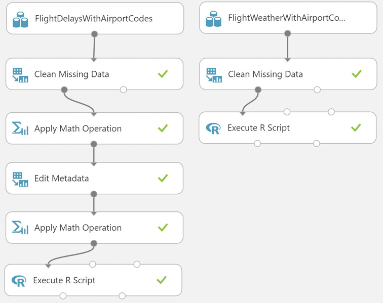
15.	Click the first output port of the Execute R Script module. 
16.	In the statistics, verify that WindSpeed, SeaLevelPressure, and HourlyPrecip are now all Numeric Feature types and that they have no missing values.

### **Task 5:** Join the Flight and Weather datasets

1.	With both datasets ready, we want to join them together so that we can associate historical flight delay with the weather data at departure time. 
2.	Drag the Join Data module on to the design surface, beneath and centered between both Execute R Script modules. Connect the output port (1) of the left Execute R module to input port (1) of the Join Data module, and the output port (1) of the right Execute R module to the input port (2) of the Join Data module. 

3.	In the **Properties** panel, relate the rows of data between the two sets L (the flight delays) and R (the weather). Set the Join key columns for L to include OriginAirportCode, Month, DayofMonth, and CRSDepHour. 
4.	Set the join key columns for R to include AirportCode, Month, Day, and Hour. 
5.	Leave the Join Type at inner join and uncheck **Keep right key columns in joined table** (so that we do not include the redundant values of AirportCode, Month, Day, and Hour).

6.	Next, add an **Edit Metadata** module and connect its input port to the output port of the Join Data module. We will use this module to convert the fields that were unbounded String feature types, to the enumeration like Categorical feature. On the **Properties** panel, set the Selected columns to DayOfWeek, Carrier, DestAirportCode, and OriginAirportCode. Set the Categorical drop down to **Make categorical**.
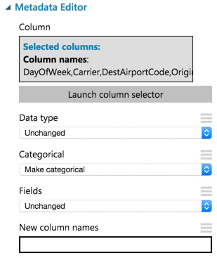
7.	Add a **Select Columns in Dataset** module. Choose **Begin With All Columns**, choose **Exclude** and set the selected columns to exclude: **OriginLatitude**, **OriginLongitude**, **DestLatitude**, and **DestLongitude**.

8.	Connect the output of the Metadata Editor to the input of the Select Columns in Dataset module.
9.	Save your experiment.

### **Task 6:** Train the model

AdventureWorks Travel wants to build a model to predict if a departing flight will have a 15-minute or greater delay. In the historical data they have provided, the indicator for such a delay is found within the DepDel15 (where a value of 1 means delay, 0 means no delay). To create a model that predicts such a binary outcome, we can choose from the various Two-Class modules that Azure ML offers. For our purposes, we begin with a Two-Class Logistic Regression. This type of classification module needs to be first trained on sample data that includes the features important to making a prediction and must also include the actual historical outcome for those features.

The typical pattern is split the historical data so a portion is shown to the model for training purposes, and another portion is reserved to test just how well the trained model performs against examples it has not seen before.
 
1.	Drag a Split module beneath Select Columns in Dataset and connect them.

2.	On the **Properties** panel for the Split Data module, set the Fraction of rows in the first output dataset to **0.7** (so 70% of the historical data will flow to output port 1). Set the Random seed to **7634**. 
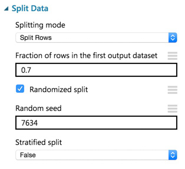
3.	Next, add a Train Model module and connect it to output 1 of the Split Data module.

4.	On the **Properties** panel for the Train Model module, set the Selected columns to **DepDel15**.

5.	Drag a Two-Class Logistic Regression module above and to the left of the Train Model module and connect the output to the leftmost input of the Train Model module

6.	Below the Train Model drop a Score Model module. Connect the output of the Train Model module to the leftmost input port of the Score Model and connect the rightmost output of the Split Data module to the rightmost input of the Score Model.

7.	Run the experiment.
8.	When the experiment is finished running (which takes a few minutes), right-click on the output port of the Score Model module and select **Visualize** to see the results of its predictions. **You should have a total of 13 columns**.

9.	If you scroll to the right so that you can see the last two columns, observe there is a Scored Labels column and a Scored Probabilities column. The former is the prediction (1 for predicting delay, 0 for predicting no delay) and the latter is the probability of the prediction. In the following screenshot, for example, the last row shows a delay predication with a 53.1% probability.

10.	While this view enables you to see the prediction results for the first 100 rows, if you want to get more detailed statistics across the prediction results to evaluate your model’s performance, you can use the Evaluate Model module.
11.	Drag an Evaluate Model module on to the design surface beneath the Score Model module. Connect the output of the Score Model module to the leftmost input of the Evaluate Model module. 

12.	Run the experiment.
13.	When the experiment is finished running, right-click the output of the Evaluate Model module and select **Visualize**. In this dialog box, you are presented with various ways to understand how your model is performing in the aggregate. While we will not cover how to interpret these results in detail, we can examine the ROC chart that tells us that at least our model (the blue curve) is performing better than random (the light gray straight line going from 0,0 to 1,1)—which is a good start for our first model!


### **Task 7:** Operationalize the experiment

1.	Now that we have a functioning model, let us package it up into a predictive experiment that can be called as a web service.
2.	In the command bar at the bottom, click **Set Up Web Service** and then select **Predictive Web Service [Recommended]**. (If Predictive Web Service is grayed out, run the experiment again)

3.	A copy of your training experiment is created that contains the trained model wrapped between web service input (e.g. the web service action you invoke with parameters) and web service output modules (e.g., how the result of scoring the parameters are returned).
4.	We will make some adjustments to the web service input and output modules to control the parameters we require and the results we return.
5.	When packaging the Predictive Web Service, Azure ML added two Apply Transformation modules which are not needed. **Delete both of the Apply Transformation Modules**.

6.	The Apply Transformation Modules were added to support the Clean Missing Data modules. We will not be using these steps in our flow, so **delete both Clean Missing Data Modules**.

7.	Reconnect the FlightDelaysWithAirportCodes to the input to Apply Math Operation module that is directly beneath it.

8.	Reconnect the FlightWeatherWithAirportCodes module to the leftmost input port of the Execute R Script module beneath it.

9.	Now move the web service input down so it is to the right of the Join Data module. Connect the output of the Web service input to input of the Metadata Editor.

10.	Right-click the line connecting the Join Data module and the Edit Metadata and select Delete.

11.	In between the Join Data and the Metadata Editor modules, drop a Select Columns in Dataset module. In the **Properties** panel for the Select Columns in Dataset module, set the Select columns to **all columns**, exclude columns **DepDel15**, **OriginLatitude**, **OriginLongitude**, **DestLatitude**, and **DestLongitude**. This configuration will update the web service metadata so that these columns do not appear as required input parameters for the web service.
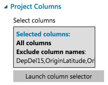
12.	Connect the Select Columns in Dataset input to Join Data and its output to Metadata Editor.
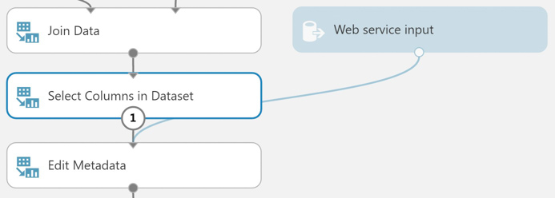
13.	Select the Select Columns in Dataset module that comes after the Metadata Editor and delete it.
14.	Connect the output of the Edit Metadata directly to the right input of the Score Model module.

15.	As we removed the latitude and longitude columns from the dataset to remove them as input to the web service, we have to add them back in before we return the result so that the results can be easily visualized on a map. 
16.	To add these fields back, begin by deleting the line between the Score Model and Web service output.
17.	Drag the AirportCodeLocationLookupClean dataset on to the design surface, positioning it below the Score Model module.

18.	Add a Join Data module. In the **Properties** panel for the Join Data module, for the Join key columns for L set the selected columns to **OriginAirportCode**. For the Join key columns for R, set the Selected columns to **AIRPORT**. Uncheck Keep right key columns in joined table.

19.	Connect the output of the Score Model module to the leftmost input of the Join Data module and the output of the dataset to the rightmost input of the Join Data module.

20.	Add a Select Columns in Dataset module beneath the Join Data module. In the **Property** panel, begin with **All Columns**, and set the Selected columns to **exclude** the columns: **AIRPORT_ID** and **DISPLAY_AIRPORT_NAME**.

21.	Connect the Join Data output to the input of the Select Columns in Dataset module.

22.	Add an Edit Metadata module. In the **Properties** panel for the Metadata Editor, set the Selected columns to LATITUDE and LONGITUDE. In the New column names enter: **OriginLatitude**, **OriginLongitude**.

23.	Connect the output of the Select Columns in Dataset module to the input of the Edit Metadata module.

24.	Connect the output of the Edit Metadata to the input of the web service output module.

25.	Run the experiment.
26.	When the experiment is finished running, click **Deploy Web Service**, **Deploy Web Service [NEW]**.
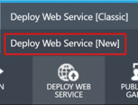
27.	Enter a Web Service Name, then select the **Standard DevTest** (FREE) Monthly Plan Option.
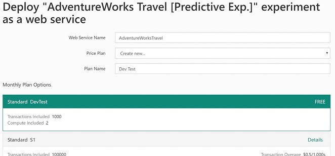
28.	Enter a Plan Name, then click **Deploy**.
29.	When the deployment is complete, you will be taken to the Web Service Quickstart page. Click on the **Consume** tab.


Leave this page open for the next task.

### **Task 8:** Integrate the web service with the sample web app

1.	From the Web Service consume page, copy the API’s Primary Key.
2.	With the sample web app open in Visual Studio, right-click the project properties, click Properties, and then navigate to the **Settings** tab. 
3.	Paste the API KEY into the value column for the setting titled ML_APIKEY.
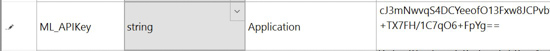
4.	Scroll down until you see the **Request-Response** URL. From this URL you can get the Workspace ID and the Service ID. 
    * **Example:** [https://**ussouthcentral**.services.azureml.net/workspaces/**f8a24adcde7c45e1bb1c9ef85fe36f62**/services/**656c53c99cc848e1a476f5068ba39fb6**/execute?api-version=2.0&details=true](https://ussouthcentral.services.azureml.net/workspaces/f8a24adcde7c45e1bb1c9ef85fe36f62/services/656c53c99cc848e1a476f5068ba39fb6/execute?api-version=2.0&details=true)
5.	The first term (e.g., ussouthcentral) is the region prefix for your ML workspace. The first GUID after Subscriptions is your Workspace ID. The second GUID after services is your Service ID. 
6.	 Copy each of these values into the settings ML_RegionPrefix, ML_WorkspaceID and ML_ServiceID respectively in the Settings area of the sample web app in Visual Studio.

7.	Save the solution.
8.	Publish the sample. 
9.	View the sample home page. 
10.	Fill out the flight criteria and click **Predict Delays** (remember to update the departure date so it is within 10 days of today). In addition to the weather forecast, you should see the delay prediction and confidence.
