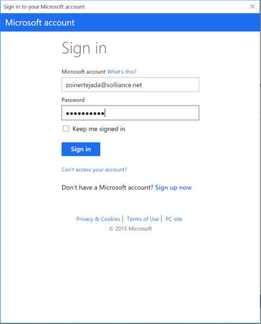
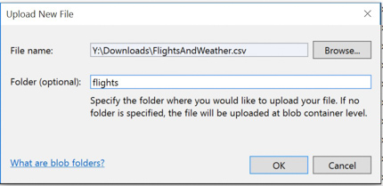
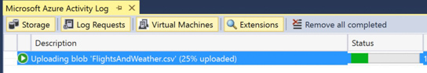

## **Exercise 4:** Batch score data with Azure ML and summarize with SQL Data Warehouse

**Duration:** 60 mins

**Synopsis:** In this exercise, attendees will batch score and prepare a summary of flight delay data in SQL Data Warehouse. 

### **Task 1:** Batch score flight data

1.	AdventureWorks has provided a sample CSV file to batch score using your Azure ML model. You can download it from http://bit.ly/1XGg6M5. 

2.	Open Visual Studio.

3.	From the **View** menu, select **Cloud Explorer**.


4.	If prompted, sign in to Visual Studio. Enter your login and click **Continue**.


5.	Select the appropriate option for work or school account or Microsoft account.


6.	Enter your password and click **Sign In**.


7.	Allow Cloud Explorer about 30 seconds to load your subscription resources. 

8.	Expand **Storage Accounts**. It may take a few moments to load.


9.	Expand the Storage Account you created for this workshop, then right-click **Blob Containers** and select **Create Blob Container**.


10.	Provide a name for the container.

11.	Right-click the new container, and select **Open Blob Container Editor**.


12.	In the document that appears, click **Upload Blob**.


13.	In the Upload New File dialog box, browse to the FlightsAndWeather.csv file you downloaded and select it. Enter flights in the Folder field, and click **OK**.


14.	Wait for the upload to complete.


15.	Open a browser and navigate to Azure Machine Learning Web Services and click **Web Services**. You can always get there by going to https://services.azureml.net/.

16.	Click on your web service.

17.	Click on the **Consume** tab.

18.	On this page, take note of the PRIMARY KEY below the Basic Consumption Info section. You will need this value in a subsequent step.

19.	Also within this section, observe the BATCH REQUESTS URL.


20.	The sequence of letters and numbers following subscriptions/ is your workspace ID. Take note of this ID. The sequence of letters and numbers following services/ is your service ID, take note of this ID as well.


21.	With the sample app open in Visual Studio. In Solution Explorer, right-click the project, select **Properties**, and then click the **Settings** tab. 

22.	 Verify the values for the following settings from your published Machine Learning service (they should be exactly the same as what you used for the request/response task earlier):

```
ML_APIKey: PRIMARY KEY for your Machine Learning web service
ML_StorageAccount: The connection string to the Storage Account where you uploaded the flights CSV.
ML_WorkspaceID: The ID of the Machine Learning Workspace.
ML_ServiceID: The ID of your Machine Learning web service.
ML_RegionPrefix: The name of the region in which your ML service is deployed.
```


23. Save the solution.

24. Publish the solution.

25. Navigate to your deployed sample in the browser, but instead of going to the homepage go to BatchScore, for example:

    * http://\<yourwebapp\>.azurewebsites.net/BatchScore

26. Modify the values of the relative paths for the location of the file to score and the location of scored output to that it is correct for your environment, for example:

    * Relative location of file to score:
    **\<ContainerName\>**/flights/FlightsAndWeather.csv
    
    * Relative location of scored output file: **\<ContainerName\>**/flights/Scored_FlightsAndWeather.csv

27. Click **Submit Job**.

28. When a Job ID appears, click **Start Job** to begin the batch scoring process.

29. Periodically click check job status until you see the job status of Job is finished. This will take 1-2 minutes. You now have a scored CSV ready for summarization using SQL Data Warehouse.

### **Task 2:** Summarize delays by airport

1.	Using Visual Studio, go to Cloud Explorer by selecting **View**, **Cloud Explorer**.


2.	Expand SQL Databases


3.	Right-click your SQL Data Warehouse and select **Open SQL Server Object Explorer**. If this fails with an error, you can always open SQL Server Object Explorer from the View menu and then add your SQL Server manually.
    

    * Use the Connect dialog as displayed below to connect to your SQL Server manually if the automatic connection failed:
    

    * If you get an error like the one below, it is probably because your IP Address is not added as a client that can access the SQL Database
    

    * You will need to head to your SQL Database blade in Azure Portal and choose Firewall and click on the “Add Client IP”
    

4.	In SQL Server Object Explorer, right-click your SQL Data Warehouse database and select **New Query**.


5.	In the document that appears, paste the following query, which stores the connection information to your Azure Storage Account (that contains the Scored_FlightAndWeather.csv) and defines a particular container and path as the root for subsequent steps. Substitute in your Storage Account Name and Storage Account Key (replacing the \<StorageAccountKey\>, \<Container\>, and \<StorageAccountName\> in the query with the corresponding values you can get from the Azure Portal). 

```SQL
CREATE MASTER KEY;

CREATE DATABASE SCOPED CREDENTIAL ASBSecret 
WITH IDENTITY = 'flightdelaysclient'
,    Secret = '<StorageAccountKey>'
;

CREATE EXTERNAL DATA SOURCE azure_storage 
WITH
(
    TYPE = HADOOP
,   LOCATION ='wasbs://<Container>@<StorageAccountName>.blob.core.windows.net/flights'
,   CREDENTIAL = ASBSecret
);   

CREATE EXTERNAL FILE FORMAT text_file_format 
WITH 
(   
    FORMAT_TYPE = DELIMITEDTEXT 
,   FORMAT_OPTIONS  (
                        FIELD_TERMINATOR =','
                    ,   USE_TYPE_DEFAULT = TRUE
                    )
);
```

6.	Run the Query by clicking the **Execute** icon . The first time you run a query this way, you may get an error dialog box which you can safely ignore. All error messages will be output in the output pane just below the query window.

7.	Next, append the following query which creates an external table (e.g., a table structure that is superimposed over the files in Blob storage). 

```SQL
CREATE EXTERNAL TABLE FlightDelays(OriginAirportCode char(3), Month tinyint, Day tinyint, Hour tinyint, DayOfWeek tinyint, Carrier varchar(4), DestAirportCode char(3), DepDelay15 bit, WindSpeed smallint, SeaLevelPressure decimal(4,2),   
HourlyPrecipitation decimal(8,5), DelayPredicted bit, DelayProbability decimal(5,4), 	OriginLatitude decimal(14,10), OriginLongitude decimal(14,10)) 
WITH
(
LOCATION = '/Scored_FlightsAndWeather.csv',
DATA_SOURCE = azure_storage,
FILE_FORMAT = text_file_format,
REJECT_TYPE = value,
REJECT_VALUE = 100000
);
```

8.	Highlight the query you just added and click **Execute**. (By highlighting the query, only the selection is executed.) When this completes, you should have the FlightDelays table you can query using T-SQL.

9.	Run the following T-SQL to view a sample of the contents.

```SQL
SELECT Top 100 * FROM FlightDelays;
```

10.	You should see output similar to the following:


11.	Create a View called FlightDelaysSummary by copying and pasting the following SQL and then executing it:

```SQL
CREATE VIEW FlightDelaysSummary AS
SELECT  OriginAirportCode, Cast(OriginLatitude as varchar(15)) + ',' + Cast(OriginLongitude as varchar(15))  OriginLatLong, Month, Day, Hour, Sum(Cast(DelayPredicted as int)) NumDelays, Avg(DelayProbability) AvgDelayProbability 
FROM FlightDelays 
WHERE Month = 4
GROUP BY OriginAirportCode, Cast(OriginLatitude as varchar(15)) + ',' + Cast(OriginLongitude as varchar(15)) , Month, Day, Hour
Having Sum(Cast(DelayPredicted as int) ) > 1
```

12.	Examine the contents of this view by running the following query.

```SQL
SELECT * FROM FlightDelaysSummary
```

13.	You are now ready to visualize this data with PowerBI.