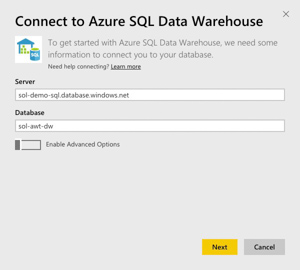
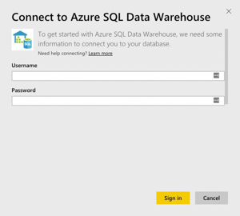
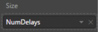
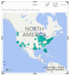
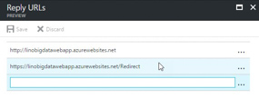

## **Exercise 5:** Visualizing in Power BI 

**Duration:** 20 mins

**Synopsis:** In this exercise, attendees will construct a report in Power BI that uses the map visualization to illustrate the predicted delays, using the data originally scored using Machine Learning, but summarized in a View within SQL Data Warehouse.

### **Task 1:** Connect Power BI to SQL Data Warehouse

1.	Log in to Power BI by going to app.powerbi.com and entering your credentials.

2.	Click **Get Data** from the bottom-left corner of the navigation bar.

3.	In the page that appears, click **Get** located within the Databases tile.

4.	In the page of tiles that appears, click the **Azure SQL Data Warehouse** tile.

5.	Click **Connect**.

    * If prompted, click on the button to start a free trial of Power BI Pro, which is required for connecting to SQL Data Warehouse.

6.	In the dialog box, enter the fully qualified name to the SQL Server hosting your SQL Data Warehouse, and then provide the name of the database.

7.	Click **Next**.

8.	Enter your Username and Password and click **Sign In**.

9.	Give the system a few moments to connect and load the metadata.

10.	When the dialog box disappears, look for the Azure SQL Data Warehouse tile on your dashboard. Select the tile.

11.	In the Visualizations, click the **Globe** icon  to add a Map visualization to the report design surface.

12.	With the Map visualization still selected, in the Fields area at right, expand the table called FlightDelaysSummary.

13.	Click and drag the field labeled OriginLatLong and drop it into the **Location** field located just below visualizations.

14.	Next, drag the field labeled NumDelays and drop it into the **Size** field.

15.	Give the map a few moments to update with the new data. Your map should look something like following:

### **Task 2:** Create a dashboard

1.	In order to create a dashboard, you need to first save your report. To give this report a name, click **File** and then click **Save**. 

2.	Enter FlightDelays in the field and click **Save**.

3.	Next you will create a dashboard from this report. 

4.	Click your newly created FlightDelays report.

5.	At the top-right of the map visual, click the **Pin** icon.

6.	In the dialog box, select **New dashboard** and name the dashboard AdventureWorks

### **Task 3:** Observe the batch score results

1.	Navigate to the deployed sample and click **Sign in to Power BI**.

2.	When prompted, sign in to Power BI with your appropriate credentials.

3.	 If you get an error that the Reply redirect was not expected from the Azure Active Directory, make sure to open the AD in the Azure portal and confirm that the Reply URL with the “/Redirect” is added

4.	 Your browser will redirect back to the sample web app and the Power BI tile with the flight delays should appear.
